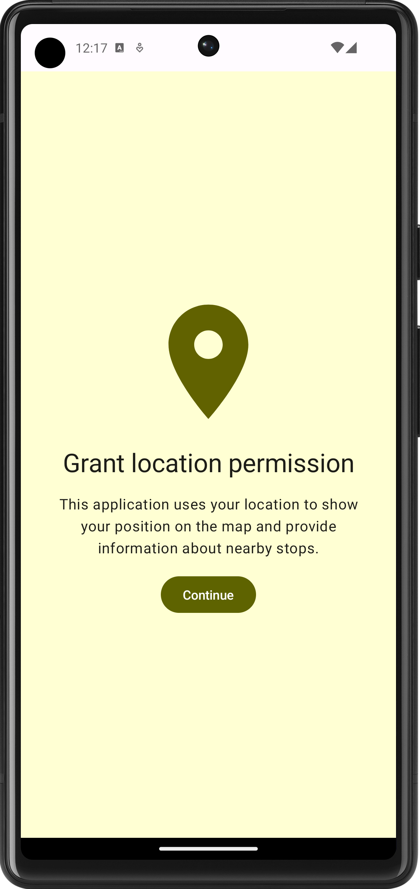
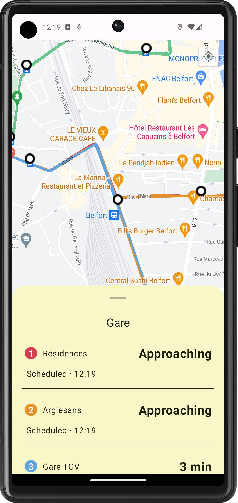

# New optymo

## Overview
New optymo is an android application that aims to provide bus schedules for the city of belfort.

## Disclaimer
This application is currently a work in progress. Some features may not be fully functional or implementend yet.

## Features
- Location permission screen: A screen that asks permission for location permission
- Interactive Map: Users can interact with the map, displaying bus stops and routes.
- Stops and routes visualization: Bus routes and stops are visually represented on the map
- Bus stop selection: Clicking on a bus stop provides schedules for the selected stop.
- Offline access to bus schedules: Bus schedules are stored locally, ensuring an access even without internet connection

## Technologies used
- Jetpack compose: For building the UI components in a declarative manner
- Viewmodel: To manage the business logic of the application
- Room: Leveraged for local data storage, ensuring data persistence.
- Dagger Hilt: Used for dependency injection, simplifying the process of object creation and providing a scalable way to manage dependencies.

## Roadmap
- Real-Time Bus Schedules: Implement functionality to fetch and display bus schedules in real-time.
- Show nearby stops: Display in the defaut bottom sheets nearby stops when location permission is enabled.
- Search Functionality: Integrate a search bar to enable users to quickly find a stop by its name.
- Bicycle station display: The city of belfort has bicycle station, this map would display the bicycle stations and additional information such as number of bicycle available per station